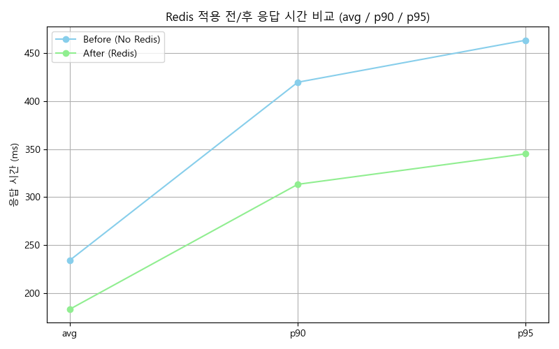

# ShortURL
URL 단축 프로젝트

#  Redis 캐시 도입 전후 성능 비교

단축 URL 서비스에 Redis 캐시를 도입하여 성능이 얼마나 개선되었는지 비교한 결과입니다.

---

## ⚙ 테스트 환경

- **Tool**: [k6](https://k6.io/)
- **Redis**: 로컬 환경에 직접 설치하여 실행 (port: 6379)
- **DB**: MySQL 8.x
- **Spring Boot**: 3.x
- **테스트 대상 URL**: `/s/{shortUrl}`

---

## 🧪 테스트 시나리오 (Redis 적용 전 vs 후 동일)

Redis 캐시 도입 전과 후의 성능을 비교하기 위해 동일한 조건으로 부하 테스트를 수행했습니다.  
사용자 수는 단계적으로 증가하며, 서버의 처리 능력을 중심으로 비교합니다.

---

### ⚙ 테스트 조건

| 항목                | 설정값                              |
|---------------------|--------------------------------------|
| 테스트 방식          | Stage 기반 Ramp-up                  |
| 단계별 가상 사용자 수 | 100 → 500 → 1000 → 0               |
| 각 단계 duration     | 1분 → 2분 → 2분 → 1분              |
| 총 테스트 시간       | 약 6분                              |
| 요청 대상 URL        | `http://localhost:8080/s/D`         |
| 리다이렉트           | 비활성화 (`redirects: 0`)           |
| 응답 체크 조건       | 상태 코드가 `200` 또는 `302`        |
| sleep() 사용         | 없음 (`stages` 방식이므로 불필요)   |

&#42; stages 방식이란?  
 지정된 시간 동안 가상 사용자 수(VUs)를 자동으로 늘리거나 줄이는 방식  
 sleep()을 명시하지 않아도 됨

---

### 🧩 테스트 비교 포인트

| 구분             | Redis 미적용 (Before) | Redis 적용 (After) |
|------------------|----------------------|-------------------|
| 캐시 여부         | 없음                | 있음 (TTL: 10분)  |
| 예상 응답 속도    | 느림 (DB 직접 조회)    | 빠름 (Redis 캐시 조회) |
| 부하 처리 능력    | 낮음                 | 높음              |
| 병목 발생 가능 시점 | 비교적 빠르게 도달       | 더 많은 사용자 처리 가능 |

---

## 📊 성능 결과 요약

| 지표 | Redis 미적용 | Redis 적용 |
|------|---------------|--------------|
| 평균 응답 시간 | 234ms | 183ms |
| 초당 처리 요청 수 | 1,897 | 2,428 |
| 총 요청 수 | 683,003 | 874,237 |
| 성공률 (200/302) | 100% | 100% |
| 200ms 미만 응답 | ~50% 이하 | 다수 개선 (p50 이하) |

---

## 📈 차트 비교

---

## 결론

Redis 도입을 통해 평균 응답 시간이 약 **22% 감소**하였고,  
초당 처리 요청 수(RPS)는 약 **28% 증가**하였습니다.  
이는 동일한 시간 동안 더 많은 요청을 빠르게 처리할 수 있게 되어,  
대용량 트래픽 상황에서도 서버 부하를 줄이고 응답 속도를 향상시킬 수 있었습니다.

